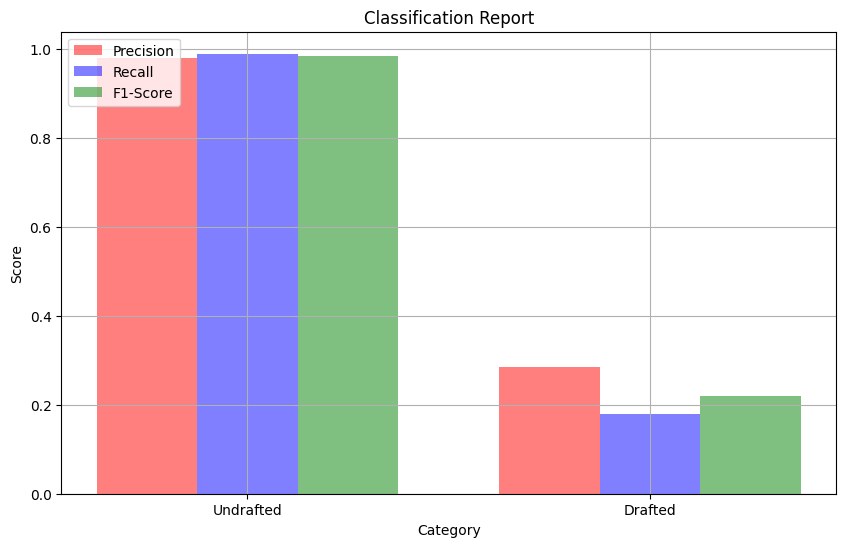
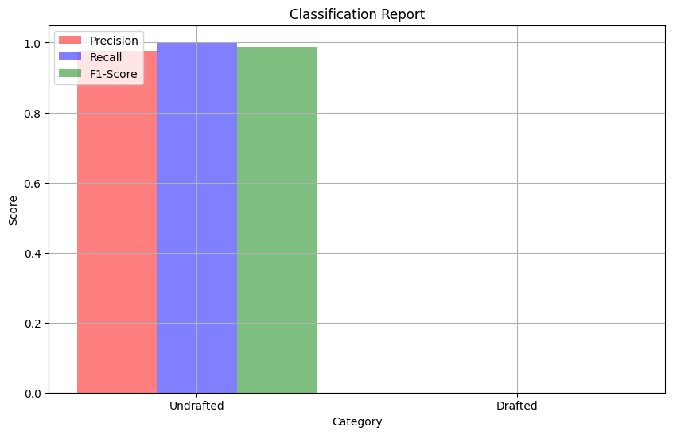
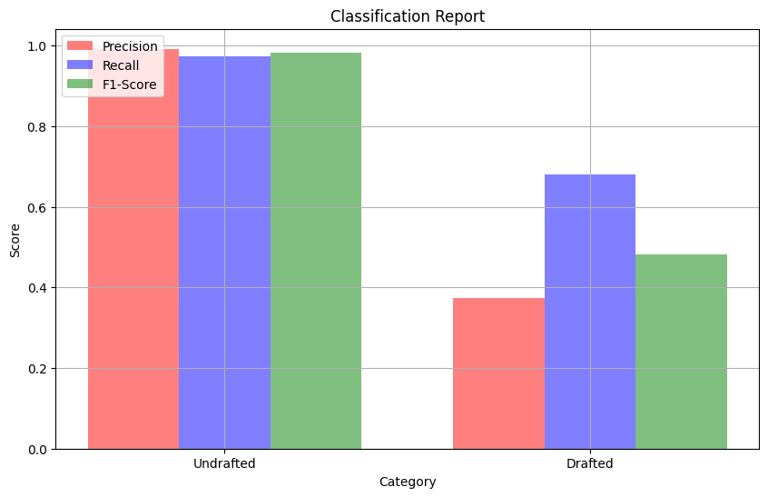
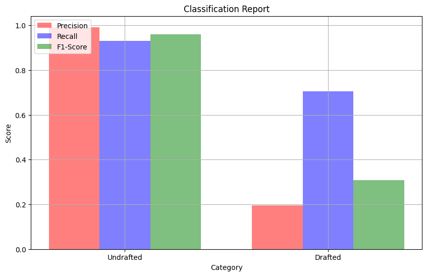
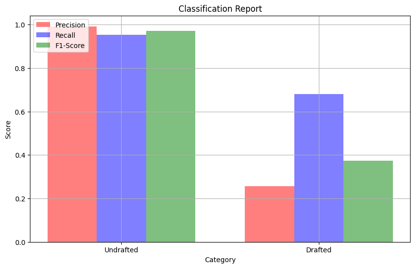

# Project-4-NBA-Draft-Machine-Learning

### Project by:
* Devon Noer
* Jack Maxwell
* Gabby Kruger
* Justyn Helgeson

## Introduction to the Project and Dataset
Our goal for this project was to find a dataset and create a model using machine learning to get an accuracy score of over 80. We chose a dataset that had college basketball stats and info and whether or not they were drafted. We decided to try and create the best model we could to predict if someone was going to get drafted or not. We started by loading in our csv and dropping columns that had too many null values, and cleaning up the data in general. Once we cleaned our data the next step was to get it into spark, so we could pull out what we wanted in our models using querys. After we had our query's all that was left was to build and optimize our models.

## Overview of files
Code :
- Project_4.ipynb : Contains the code for cleaning and transforming our data, also our first five models.
- 2024Draft_Project.ipynb : Contains the code for model six, and testing on a new dataset with 2023-2024 stats.
Images : This folder contains images of our graphs relating to how well each model performed.
Resources :
- CollegeBasketballPlayers2009-2021.csv : This is the data that we used to build all of our models off of.
- fixed_new_draft_2024.csv : This is the data that we used to predict who would get drafted in model six.

## Model 1
The first model was a neural network with the features(conf, GP, mp, pts, Ortg, usg, TS_per, FTM, FTA, twoPA, twoPM, TPM, TPA, drtg, bpm, oreb, dreb, ast, stl, blk, drafted). This model had two hidden layers, one with the activation function tanh, and the other with relu. The output layer had the activation function of sigmoid. The hidden layers had 12 and 6 neurons respectivly. This was the classification report for this model, Undrafted{precision : 0.98, recall : 0.96, f1-score : 0.97}, Drafted{precision : 0.17, recall : 0.34, f1-score : 0.23} and accuracy of 0.94. In conclusion while we reached the accuracy threshold of 0.80 we were not happy with how we performed in the Drafted class. This model was a good start for us to build off of.  

## Model 2
The second model was also a neural network and it's features were(GP, mp, pts, Ortg, usg, TS_per, FTM, twoPM, TPM, drtg, bpm, oreb, dreb, ast, stl, blk, drafted). This model had three hidden layers, all the activation funcions were sigmoid, they had 20, 18, 16 neurons respectivly. The outer layer in this model also had an activation function of sigmoid. The classification report was Undrafted{precision : 0.99, recall : 0.97, f1-score : 0.98}, Drafted{precision : 0.00, recall : 0.00, f1-score : 0.00} and accuracy of 0.98. This model did not go how we were hoping because we ended up not getting anything for the drafted column, because our dataset is imbalanced we still achieved the accuarcy score of over 0.80. We learned that we are gonna have to make some big changes to increase our Drafted section, so we decided to look up ways to deal with an imbalanced dataset and use those ideas for our next models.

## Model 3
The third model was also a neural network and it's features were(conf, team, GP, mp, pts, Ortg, usg, TS_per, FTM, eFG, stops, FTA, twoPA, twoPM, TPM, TPA, drtg, bpm, oreb, dreb, treb, AST_per, TO_per, ast, stl, blk, Min_per, FT_per, twoP_per, ORB_per, DRB_per, blk_per, TP_per, yr, drafted). This model had four hidden layers, all the activation funcions were tanh, they had 90, 85, 80, and 75 neurons respectivly. The outer layer in this model also had an activation function of sigmoid. This model also used the class_weight to try and balance the data. The classification report was Undrafted{precision : 0.98, recall : 1.00, f1-score : 0.99}, Drafted{precision : 0.33, recall : 0.69, f1-score : 0.45} and accuracy of 0.96. Using class_weight was a helpful tool because our Drafted f1 score went up to a 0.45 which we thought was very good. We are still hoping to get the Drafted section up more if we can by changing weight, layers, neurons, and what ever else we can to improve our models.

## Model 4
The fourth model was also a neural network and it's features were(GP, mp, pts, Ortg, usg, TS_per, FTM, twoPM, TPM, drtg, bpm, oreb, dreb, ast, stl, blk, drafted). This model had three hidden layers, all the activation funcions were tanh, they had 60, 50, and 40 neurons respectivly. The outer layer in this model also had an activation function of sigmoid. This model also used the class_weight to try and balance the data. The classification report was Undrafted{precision : 0.99, recall : 0.95, f1-score : 0.97}, Drafted{precision : 0.24, recall : 0.64, f1-score : 0.35} and accuracy of 0.94. Using class_weight was a helpful tool because our Drafted f1 score went up to a 0.35 which was better than our orinal models but worse than our previous model. We are still hoping to get the Drafted section up more if we can by changing weight, layers, neurons, and what ever else we can to improve our models.

## Model 5
The fifth model was a neural network with the features(conf, GP, mp, pts, Ortg, usg, TS_per, FTM, FTA, twoPA, twoPM, TPM, TPA, drtg, bpm, oreb, dreb, ast, stl, blk, drafted). This model had two hidden layers, one with the activation function tanh and the other with relu. The output layer had the activation function of sigmoid. The hidden layers had 30 and 20 neurons, respectively. This was the classification report for this model.
Undrafted{precision: 0.99, recall: 0.96, f1-score: 0.97}, Drafted{precision: 0.26, recall: 0.65, f1-score: 0.37} and accuracy of 0.95. In conclusion, although the accuracy is high, we still want better precision for Drafted. We also used class weights to recognize drafted players better in the data, which helped improve the numbers from previous attempts.

# References
Used this website to find code to turn a classification report into a graph : https://medium.com/@Doug-Creates/plotting-scikit-learn-classification-report-for-analysis-0229447fe232  
Google Slides : https://docs.google.com/presentation/d/1Ocn16RjP4gzTbt-MyaRb2DGWBDxWDFoIf-ICcamz_GI/edit#slide=id.p  
Dataset : https://www.kaggle.com/datasets/adityak2003/college-basketball-players-20092021/data?select=CollegeBasketballPlayers2009-2021.csv  
Imbalanced-Learn documentation : https://imbalanced-learn.org/stable/  
Class Weights : https://datascience.stackexchange.com/questions/13490/how-to-set-class-weights-for-imbalanced-classes-in-keras
